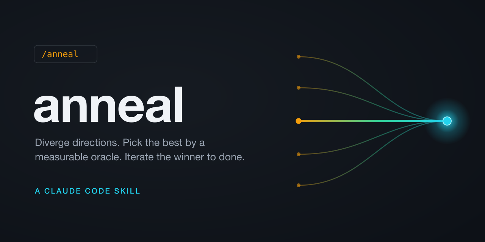
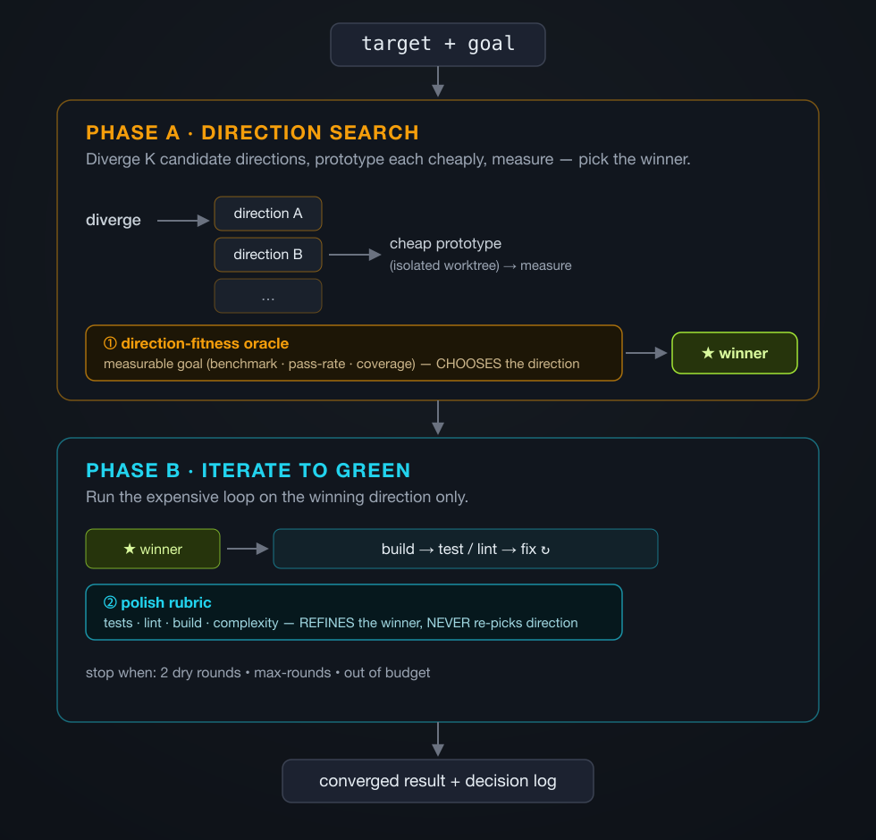

<p align="center">
  
</p>

# anneal

> A Claude Code skill that explores several directions, **picks the best by a measurable oracle**, then iterates only the winner to done — so your agent stops polishing its first idea into a local optimum.

[](LICENSE)


```
/anneal ./src/parser --goal "test suite pass-rate"
/anneal ./bench.py   --goal "elapsed seconds, lower is better"
```

---

## The problem

AI coding loops are good at *executing* — take one direction and grind it to "done." Ralph iterates a single thread until it passes. GSD / Spec Kit turn a spec into multi-agent execution. They're effective, and they're **single-track**: once a direction is chosen, it never changes.

That's the local-optimum trap. The agent refines its *first* idea — the obvious nested-loop tweak, the table view, the regex it already wrote — and never asks *"is this even the right direction?"* A polished wrong direction beats a rough right one on every quality check, so the loop digs deeper into the wrong hole.

## What anneal does

anneal adds the stage those tools skip: **cheap direction discovery and judging, before the iterate-to-done loop.** On `/anneal <target>` it:

1. **Diverges** — proposes K distinct candidate directions.
2. **Prototypes cheaply** — builds each just enough to *measure* it, in an isolated worktree.
3. **Picks by measurement** — ranks directions by a **direction-fitness oracle** (a real, measurable goal — not taste), and selects the winner.
4. **Iterates the winner to green** — runs the expensive loop on the chosen direction only, driven by a **polish rubric**.

The execution half (step 4) is the already-solved part — the kind of grind Ralph and GSD do well. anneal's contribution is the **direction-search half** that comes first.

## The core idea: two oracles, never mixed

This is the one rule the whole skill exists to enforce:

| Oracle | Question it answers | When it runs |
|---|---|---|
| **Direction-fitness** | *Which direction is better?* — measurable, task-based (benchmark, pass-rate, coverage, "clicks to find X") | Phase A, to pick the winner |
| **Polish rubric** | *How well is this one executed?* — tests, lint, build, complexity | Phase B, to refine the winner |

**The polish rubric must never choose direction.** A polished incumbent out-scores a rough challenger on polish every time — letting polish pick direction is exactly what pulls the loop back into the local optimum. Direction is chosen by the measurable oracle alone; polish only refines what's already been chosen.

## When it shines — and when it struggles

The mechanism is only as good as the direction-fitness oracle you can give it.

| | Sweet spot | Weak case |
|---|---|---|
| **Signal** | A hard, measurable oracle ranks directions | Direction quality is taste-laden |
| **Examples** | "make it faster" → benchmark; "pass this suite" → tests; coverage, bundle size, p95 latency, memory | UI / visual design ("is a graph view better than a table?") |
| **Result** | Converges on the genuinely-best direction | Degrades toward whatever the rubric *can* measure — unless you supply a **task-based** fitness ("steps to find an orphan node") or use the human checkpoint |

If no measurable goal is inferable and you don't supply one, anneal asks for it rather than faking convergence on polish.

## Quick start

Install as a user skill:

```bash
mkdir -p ~/.claude/skills/anneal
cp -R SKILL.md workflow rubrics ~/.claude/skills/anneal/
```

The skill auto-loads in any new Claude Code session; verify it appears in `/help`. (Once published to a plugin marketplace, it will also be installable with `/plugin`.)

Then invoke it:

```
/anneal <target>                                  # cheap default: 2 directions, ranked by measurement (no separate judge)
/anneal <target> --goal "<measurable fitness>"    # supply the direction-fitness goal
/anneal <target> --rubric <path>                  # plug in a custom polish rubric
/anneal <target> --directions N --judges M --max-rounds R --budget <tokens> --checkpoint direction
```

`<target>` is a path or a short description. Without one, the skill asks rather than guessing.

## How it works

<p align="center">
  
</p>

**Phase A — direction search (cheap, once).** Propose K directions → build a lightweight prototype of each in its own worktree → measure each against the goal → pick the highest-fitness winner. Logs what was and wasn't explored.

**Phase B — iterate to green (the expensive loop).** Run build → test/lint → fix on the winner, scored by the polish rubric. Stops when two consecutive rounds find no improvement, or at `--max-rounds`, or when the token budget runs out — whichever comes first.

| | Phase A — Direction search | Phase B — Iterate |
|---|---|---|
| Oracle | Direction-fitness (measurable) | Polish rubric |
| Picks direction? | **Yes — solely** | **Never** |
| Cost | Cheap prototypes | The real investment |
| Output | Winner + rejected directions, with evidence | Converged result + decision log |

The user reviews the **destination** and a decision log ("why this direction won, what was rejected and why"), not every step. Changes land on a branch; you review by diff.

## vs. prior art

| | Solves | Changes direction? |
|---|---|---|
| **Ralph / Smart Ralph** | Execution — iterate one thread to done | No (single track) |
| **GSD / BMAD / Spec Kit** | Spec → multi-agent execution | No (fixed once the spec is set) |
| **anneal** | The stage *before* execution: discover + judge directions, then iterate the winner | **Yes — that is the point** |

anneal is additive — it front-loads the direction choice those tools assume has already been made.

## Design principles

1. **Two oracles, kept apart.** Direction-fitness and polish answer different questions and are never mixed.
2. **Polish never picks direction.** The rule that prevents the local-optimum collapse.
3. **Fitness must be measurable.** No measurable goal, no honest convergence — the skill asks rather than faking it on polish.
4. **Cheap prototypes for the search.** Build only enough of each direction to score it; the winner gets the real investment.
5. **Bounded loops.** The token budget is a hard cap, not advice. Loops stop when dry, capped, or out of budget.

## Honest limits

- It does **not** converge on objective best for taste targets — only "best per the encoded rubric." Those need a user-supplied task-based fitness or the `--checkpoint direction` human gate.
- It is **not** free. Loops are token-heavy; the budget cap is mandatory, and a budget under ~50k tokens leaves no room to iterate.
- It does **not** explore exhaustively. Divergence breadth bounds discovery — it logs what it did not explore.
- It does **not** give you a truly independent referee. Judges share the generator's model priors.
- It can **broaden scope inside a rich repo.** When the target sits among other tempting files, worktree agents may "improve" the surroundings instead — isolate the target or scope the goal tightly ("optimize only this file").
- It does **not** degrade gracefully if a sub-agent fails to finalize — the run aborts; re-run if that happens.

## Self-eval fixture

`eval/dup-finder/` is the skill's own hard-oracle test fixture: a deliberately naive O(n²) duplicate finder where the O(n) hash-set rewrite is provably far faster. `python3 eval/dup-finder/target.py` prints the baseline; `eval/dup-finder/expected.md` states the convergence the engine should reach — pick the O(n) direction by measured elapsed (not by polishing the O(n²) incumbent) and drive it under `baseline/5`. A fully hands-off end-to-end run depends on the host's multi-agent and git-worktree support.

## Status

Early. The two-oracle framing and the loop are the stable core; flags and defaults may move. Re-divergence (re-running the search) is intentionally deferred to a later version — v1 picks once, so there is no oscillation risk by construction.

## License

MIT — see [LICENSE](LICENSE).

## Author

[@moonweave](https://github.com/moonweave)
